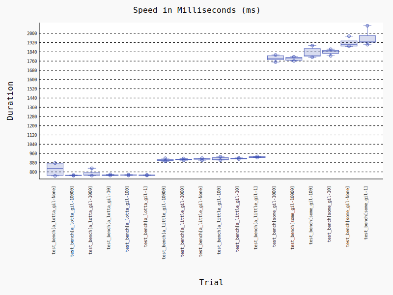

## GIL Knocker


`pip install gilknocker`


[](https://github.com/python/black)
[](https://github.com/milesgranger/gilknocker/actions/workflows/CI.yml)
[](https://pypi.org/project/gilknocker)

[](https://pepy.tech/project/gilknocker)


When you thought the GIL was available, and you find yourself suspecting it might be spending time
with another. 

You probably want [py-spy](https://github.com/benfred/py-spy), however if you're
looking for a quick-and-dirty way to slip in a GIL contention metric within a specific
chunk of code, this might help you.

### How?

Unfortunately, there doesn't appear to be any explicit C-API for checking how busy
the GIL is. [PyGILState_Check](https://docs.python.org/3/c-api/init.html#c.PyGILState_Check) 
won't really work, that's limited to the current thread. 
[PyInterpreterState](https://docs.python.org/3/c-api/init.html#c.PyGILState_Check) 
is an opaque struct, and the [PyRuntimeState](https://github.com/python/cpython/blob/main/Include/internal/pycore_pystate.h)
and other goodies are private in CPython.

So, in ~200 lines of Rusty code, I've conjured up a basic metric that seems 
to align with what is reported by `py-spy` when running the same [test case](./tests/test_knockknock.py).
This works by spawning a thread which, at regular intervals, re-acquires the GIL and checks 
how long it took for the GIL to answer.

Note, the interval (`interval_micros`) is configurable. The lower the value, the 
more accurate the metric, but will be more likely to slow your
program down.. because it will play a larger role in competing for the GIL's attention.

### Use

Look at the [tests](./tests)

```python

from gilknocker import KnockKnock

knocker = KnockKnock(interval_micros=1000, timeout_secs=1)
knocker.start()

... smart code here ...

knocker.contention_metric  # float between 0-1 indicating roughly how busy the GIL was.
knocker.reset_contention_metric()  # reset timers and meteric calculation

... some more smart code ...

knocker.stop()

knocker.contention_metric  # will stay the same after `stop()` is called.

```

### How will this impact my program?

Short answer, it depends, but probably not much. As stated above, the more frequent the 
monitoring interval, the more likely GIL bound tasks will be affected. This is demonstrated 
in the [benchmarks](./benchmarks) testing. Below is a summary of benchmarking two different 
functions, one which uses the GIL, and one which releases it. For `interval=None` this means 
no polling was used, effectively just running the function without `gilknocker`. Otherwise, 
the interval represents the value passed to `KnockKnock(interval_micros=interval)`

`python -m pytest -v --benchmark-only benchmarks/ --benchmark-histogram`

```
---------------------------------------------------------------------------------------------- benchmark: 12 tests ----------------------------------------------------------------------------------------------
Name (time in ms)                          Min                   Max                  Mean             StdDev                Median                 IQR            Outliers     OPS            Rounds  Iterations
-----------------------------------------------------------------------------------------------------------------------------------------------------------------------------------------------------------------
test_bench[a_lotta_gil-None]          697.6828 (1.0)        804.5402 (1.11)       755.6981 (1.06)     53.0970 (61.53)      777.1266 (1.09)     101.6509 (83.91)         2;0  1.3233 (0.95)          5           1
test_bench[a_lotta_gil-10]            707.0513 (1.01)       724.3552 (1.0)        714.4783 (1.0)       6.8460 (7.93)       715.2083 (1.0)       10.0545 (8.30)          2;0  1.3996 (1.0)           5           1
test_bench[a_lotta_gil-1000]          708.0325 (1.01)       742.4564 (1.02)       722.2247 (1.01)     12.6517 (14.66)      721.7707 (1.01)      12.5343 (10.35)         2;0  1.3846 (0.99)          5           1
test_bench[a_lotta_gil-10000]         716.1168 (1.03)       791.8905 (1.09)       733.0825 (1.03)     32.9744 (38.21)      717.7345 (1.00)      23.2516 (19.19)         1;1  1.3641 (0.97)          5           1
test_bench[a_lotta_gil-100000]        758.2248 (1.09)       760.4424 (1.05)       759.2441 (1.06)      0.8629 (1.0)        758.9144 (1.06)       1.2114 (1.0)           2;0  1.3171 (0.94)          5           1
test_bench[a_lotta_gil-100]           760.8787 (1.09)       839.1526 (1.16)       777.9811 (1.09)     34.2144 (39.65)      763.4823 (1.07)      20.4199 (16.86)         1;1  1.2854 (0.92)          5           1
test_bench[a_little_gil-None]       1,505.1989 (2.16)     1,510.2234 (2.08)     1,508.0564 (2.11)      1.8985 (2.20)     1,508.2229 (2.11)       2.5074 (2.07)          2;0  0.6631 (0.47)          5           1
test_bench[a_little_gil-100000]     1,506.0053 (2.16)     1,559.4051 (2.15)     1,531.3341 (2.14)     22.6875 (26.29)    1,524.5321 (2.13)      38.7802 (32.01)         2;0  0.6530 (0.47)          5           1
test_bench[a_little_gil-10000]      1,508.9686 (2.16)     1,521.0912 (2.10)     1,515.0701 (2.12)      5.5128 (6.39)     1,514.7033 (2.12)      10.3673 (8.56)          2;0  0.6600 (0.47)          5           1
test_bench[a_little_gil-1000]       1,534.0449 (2.20)     1,540.6296 (2.13)     1,537.8621 (2.15)      2.5307 (2.93)     1,538.5808 (2.15)       3.4261 (2.83)          2;0  0.6503 (0.46)          5           1
test_bench[a_little_gil-100]        1,566.4128 (2.25)     1,576.2634 (2.18)     1,569.6245 (2.20)      4.0978 (4.75)     1,567.4297 (2.19)       5.3087 (4.38)          1;0  0.6371 (0.46)          5           1
test_bench[a_little_gil-10]         1,587.1471 (2.27)     1,597.2920 (2.21)     1,592.0651 (2.23)      3.7001 (4.29)     1,591.2409 (2.22)       4.1942 (3.46)          2;0  0.6281 (0.45)          5           1
-----------------------------------------------------------------------------------------------------------------------------------------------------------------------------------------------------------------
```



---

### License

[Unlicense](LICENSE) or [MIT](LICENSE-MIT), at your discretion.
